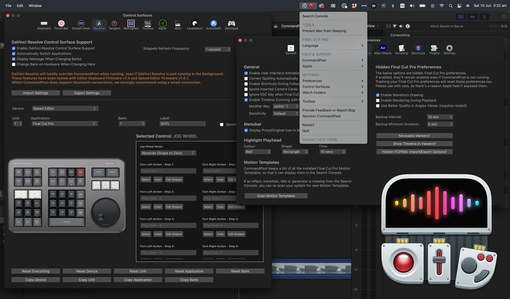
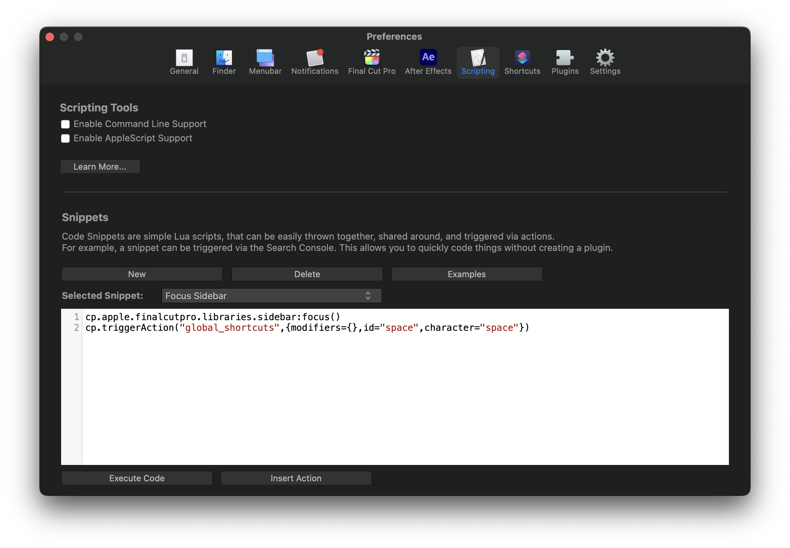
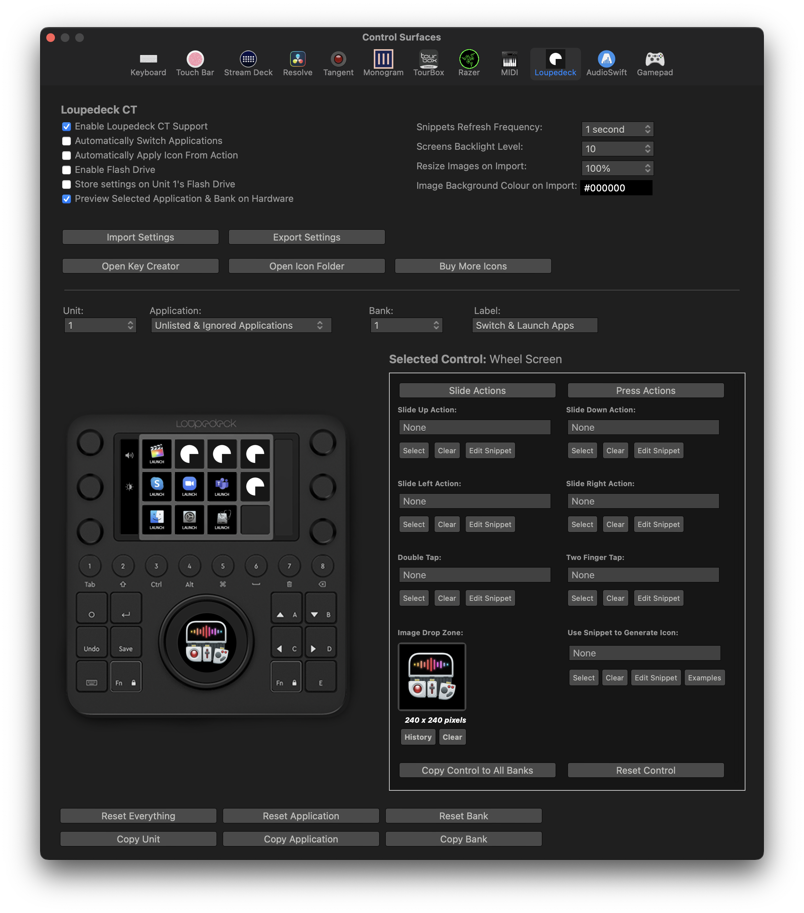
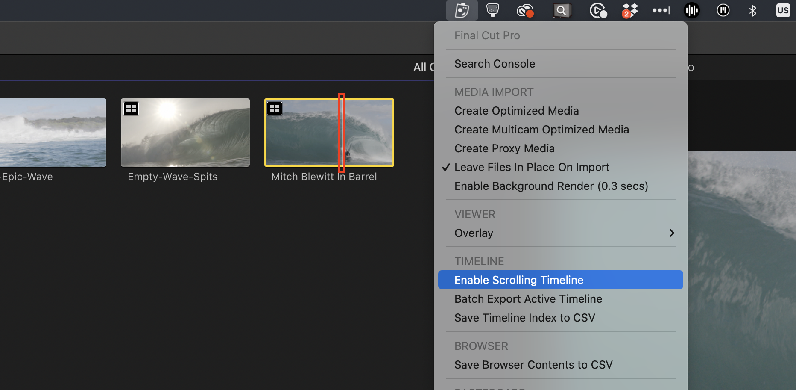
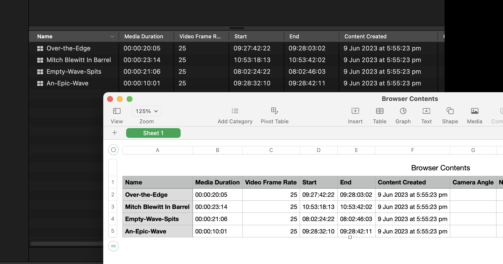
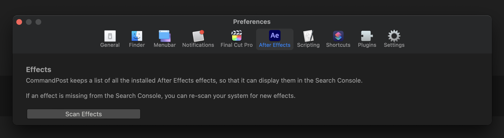
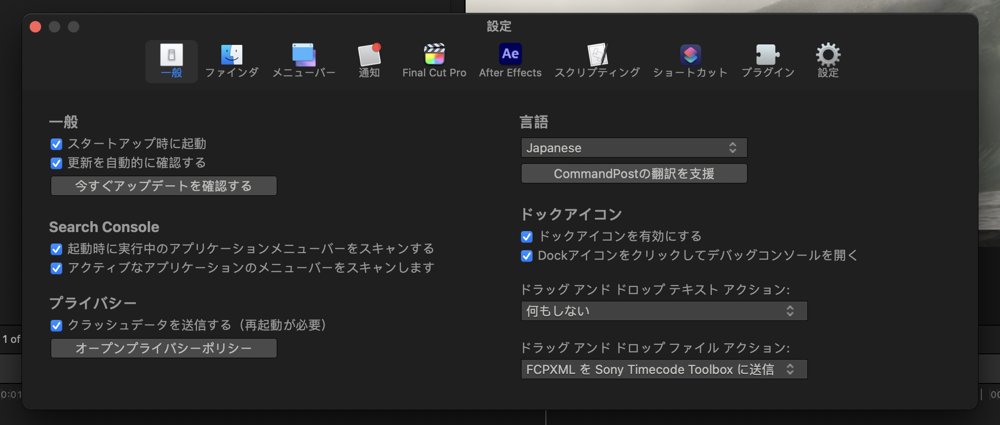
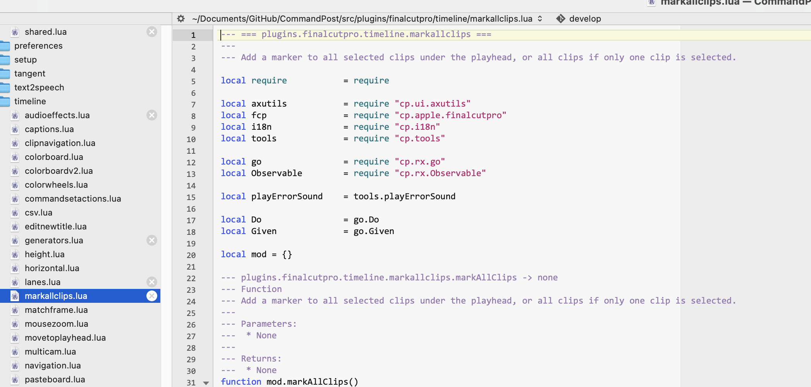

# CommandPost

**The Swiss Army Knife for Post Production Professionals**

CommandPost is a [open source](https://github.com/CommandPost/CommandPost/blob/develop/LICENSE.md) macOS application that makes your post production and editing life **faster** and **lots more fun** (everything better with more buttons!).

It's been used for projects at **Netflix**, **Pixar** and the **BBC**. People at companies such as **Apple**, **Avid** and **Adobe** use it daily.

All of the 2024 and 2025 **Apple Worldwide Developer Conference (WWDC)** videos were graded using Tangent panels in Final Cut Pro controlled by CommandPost. 🥳

After **9 years of free updates**, to ensure that CommandPost continues to be developed, improved, and stay open-source, we've decided that you need at least **ONE** paid [LateNite application](https://apps.apple.com/au/developer/latenite-films-pty-ltd/id1652018641) installed to use CommandPost moving forward - consider it "inner circle" software (i.e. only our mates get access to it).

The cheapest option is only **USD$10**. Thank you to EVERYONE who has supported CommandPost throughout these years!

You can read more about this decision on the [FAQ page](/faq/#why-is-commandpost-no-longer-free).

It adds **hundreds** of features to Apple’s [Final Cut Pro](https://www.apple.com/final-cut-pro/) to make it even better and more enjoyable to edit with.

It has **extensive** control surface support - allowing you to control your Mac anyway you want. It's also fully **native on Apple Silicon**.

It's been downloaded over **277 thousand times**, and there are over **[3 thousands members](https://www.facebook.com/groups/commandpost/members)** in our active [Facebook Community](https://www.facebook.com/groups/commandpost/).

We also have a rapidly growing [Discord community](https://ltnt.tv/discord) full of industry veterans and professionals.

---

### Used by Professionals

Rather than produce our own video tutorials - CommandPost is so popular that the community does it for us!

Watch this awesome introduction video by Arthur Moore on [YouTube](https://www.youtube.com/watch?v=2IkCYS9Svrw) on 14th September 2019:

---

### Built for Professionals

We developed new CommandPost features especially for **[Apollo: Missions to the Moon](https://www.imdb.com/title/tt9782756/)**, edited by [David Tillman](https://twitter.com/davidtillman).

We've also built custom tools for Denmark’s second largest production company, **[Metronome Productions](http://www.fcp.co/final-cut-pro/news/867-metronome-celebrate-a-documentary-series-cut-on-fcpx-with-a-birthday-cake)**.

> _“ Titles to Keywords is a huge timesaver when editing complex scenes. Couldn’t live without it anymore. And directors love that every delivery of any line from any take is just one click away! ”_ 
> **[Knut Hake](http://www.knuthake.de)** - _Editor on Netflix's Blood Red Sky_

**Blood & Gold** was cut on Final Cut Pro and made extensive use of CommandPost's [Titles to Keywords Toolbox](https://commandpost.io/toolbox/titles-to-keywords/).

---

### Where Technology Meets Creativity

> _“ CommandPost and FCP are so intertwined on my day to day that I see them as one app! ”_ 
> **[Marcos Castiel BFE](http://www.marcoscastiel.com/)** - _Editor on Netflix's Turn of the Tide_

CommandPost has been **built by filmmakers, for filmmakers**.

However, it's also used by developers, scientists and macOS power users all over the world to seriously speed up mundane tasks through powerful and customisable automation tools.

---

### Experience Unparalleled Control

> _“ Command Post started as a FCPX utility but it goes further than that. You can use it to map almost any function to supported hardware devices to work with any app like a BMD Speed Editor and Avid Media Composer! ”_ 
> **[Marc Bach](https://www.interfacelab.tv)** - _Editor & Colourist_

CommandPost has deep support for a wide range of **control surfaces**.

It even brings back **[Razer](/control-surfaces/razer/)** keypad support to the Mac!

> _“ Chris's support is the best you will find anywhere on the planet. He was proactive and able to implement features for me on the spot. 5 STAR product 5 STAR support. ControllerMate is what I used to use. CommandPost is faster and easier. ”_ 
> **[Ross Batten](https://www.roscoaudio.com.au)** - _Senior Sound Designer (ProTools)_

You can basically control **ANYTHING** in Final Cut Pro with a huge range of control surfaces.

**[Tangent](/control-surfaces/tangent/)**, **[Monogram](/control-surfaces/monogram/)** and **[Loupedeck](/control-surfaces/loupedeck/)** all officially rely on CommandPost for Final Cut Pro support.

---

### Powerful Search Console Redefines Navigation

> _“ Search Console is like Spotlight on steroids. It can quickly find and execute any obscure command, NLE and OS-wide, fire up keyboard makros (scripts), and especially, find and place Effects and Effect Templates, directly onto selected clips in my FCP timeline. It constantly saves me clicks. ”_ 
> **[Florian Duffe](https://florian-duffe.de/en/flow-en/)** - _Editor_

CommandPost has an insanely powerful **Search Console** that allows you to trigger all of CommandPost's actions.

Like Spotlight, this is accessible system-wide, and is also used to quickly assign actions to control surfaces buttons and knobs.

---

### Revolutionise Your Workflow

> _“ CommandPost is so many things for so many people. For me it is a Final Cut Pro automation system that unlocks hidden features and uniquely supports advanced workflows. CommandPost’s secret weapon? Deep connections with the postproduction community which mean that it constantly improves as the needs of editors and post professionals evolve. ”_ 
> **[Alex ‘4D’ Gollner](https://alex4d.com)** - _Motion Template Creator_

CommandPost allows you to do things in Final Cut Pro that are otherwise not possible, such as **Highlight Browser Playhead** and **Scrolling Timeline**.

There's literally hundreds of actions in CommandPost for controlling Final Cut Pro in almost unlimited ways.

---

### Say Goodbye to Complexity

> _“ Chris, you have no idea how helpful your Titles to Keywords toolbox has been on our latest production. Without the toolbox these 2-3 hour long timelines (around 900 keywords) would have been nearly impossible to tag with the FCP built in way. It's very long scenes with around 50 lines of text for all characters. ”_ 
> **[Sam Pluemacher](https://www.imdb.com/name/nm10223233/)** - _Assistant Editor on Netflix's Blood Red Sky_

CommandPost can do complex things with a single keystroke, such as exporting your Final Cut Pro **Timeline Index and Browser Contents to a CSV**.

---

### Diversify Your Creativity

> _“ As someone who doesn’t like clicking to do things, CommandPost makes my work much more likeable! ”_ 
> **[Oli Frost](https://olifro.st/)** - _Editor_

Whilst CommandPost was originally designed with Final Cut Pro in mind, it can actually control **ANY** Mac application.

It's also always growing and expanding, for example it can scan After Effects so that you can trigger any effect from a control surface.

The Search Console will also list all your [Keyboard Maestro](https://www.keyboardmaestro.com/) macros, macOS Shortcuts and even AppleScript's!

---

### Multi-language Support

> _“ CommandPost supports my Loupedeck, Stream Deck and Razer devices with advanced Final Cut Pro integrations. Eliminating the need for multiple apps and reducing complexity. ”_ 
> **[Sam Pluemacher](https://www.imdb.com/name/nm10223233/)** - _Assistant Editor on Netflix's Blood Red Sky_

CommandPost has been translated into Arabic, Bengali, Catalan, Chinese (Simplified & Traditional), Danish, Dutch, French, German, Greek, Hindi, Hungarian, Italian, Japanese, Korean, Malayalam, Norwegian, Panjabi/Punjabi, Polish, Portuguese, Russian, Spanish, Swedish, Ukrainian & Vietnamese by [our awesome community](https://poeditor.com/join/project/QWvOQlF1Sy).

---

### Powered by Lua

> _“ CommandPost is the first thing you should install If you like to tinker. This genius app extends Final Cut Pro in all kinds of ways, enabling advanced workflows, automation, and even integration with external hardware such as MIDI controllers. Recommended. ”_ 
> **[Iain Anderson](https://iain-anderson.com)** - _Author of Final Cut Pro Efficient Editing_

Powered by [Lua](https://dev.commandpost.io/lua/overview/) (the same scripting language used by [Blackmagic Fusion](https://www.blackmagicdesign.com/products/fusion/), [Adobe Lightroom](https://www.adobe.com/au/products/photoshop-lightroom.html) and even parts of [Apple iOS](https://twitter.com/_inside/status/1026173832527265792)), it's insanely customisable and powerful.

Every part of CommandPost can be easily modified and enhanced in a simple text editor. All the interfaces are built in plain HTML.

It's also fully compatible with [Hammerspoon](http://www.hammerspoon.org) Lua scripts.

---

[Download now](/download) for **free** and accelerate your post production workflow...
