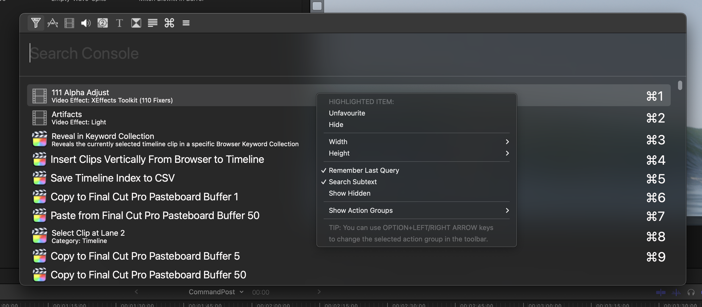

# CommandPost

**The Swiss Army Knife for Post Production Professionals**

CommandPost is a **free** and [open source](https://github.com/CommandPost/CommandPost/blob/develop/LICENSE.md){target="_blank"} macOS application that makes your post production and editing life faster and more fun.

It adds **hundreds** of features to Apple’s [Final Cut Pro](https://www.apple.com/final-cut-pro/){target="_blank"} to make it even better and more enjoyable to edit with.

It has **extensive** control surface support - allowing you to control your Mac anyway you want.

It's been downloaded over **[168 thousand times](https://hanadigital.github.io/grev/?user=commandpost&repo=commandpost){target="_blank"}**, and there are over **[2.6 thousands members](https://www.facebook.com/groups/commandpost/members){target="_blank"}** in our active [Facebook Community](https://www.facebook.com/groups/commandpost/){target="_blank"}.

It's been used for projects at **Netflix**, **Pixar** and the **BBC**. People at companies such as **Apple**, **Avid** and **Adobe** use it daily.

---

### Built for Professionals

We developed new CommandPost features especially for **[Apollo: Missions to the Moon](https://www.imdb.com/title/tt9782756/){target="_blank"}**, edited by [David Tillman](https://twitter.com/davidtillman){target="_blank"}.

We've also built custom tools for Denmark’s second largest production company, **[Metronome Productions](http://www.fcp.co/final-cut-pro/news/867-metronome-celebrate-a-documentary-series-cut-on-fcpx-with-a-birthday-cake){target="_blank"}**.

> _“ Titles to keywords is a huge timesaver when editing complex scenes. Couldn’t live  without it anymore. And directors love that every delivery of any line from any take I just one click away. ”_ 
> **[Knut Hake](http://www.knuthake.de){target="_blank"} (Editor on Netflix's Blood Red Sky)**

> _“ Chris, you have no idea how helpful your Titles to Keywords toolbox has been on our latest production. Without the toolbox these 2-3 hour long timelines (around 900 keywords) would have been nearly impossible to tag with the FCP built in way. It's very long scenes with around 50 lines of text for all characters. ”_ 
> **[Sam Pluemacher](https://www.imdb.com/name/nm10223233/){target="_blank"} (Assistant Editor on Netflix's Blood Red Sky)**

**Blood & Gold** was cut on Final Cut Pro and made extensive use of CommandPost's [Titles to Keywords Toolbox](https://commandpost.io/toolbox/titles-to-keywords/).

{target="_blank"}

---

### Where Technology Meets Creativity

> _“ CommandPost and FCP are so intertwined on my day to day that I see them as one app ”._ 
> **[Marcos Castiel BFE](http://www.marcoscastiel.com/){target="_blank"}**

CommandPost has been **built by filmmakers, for filmmakers**.

However, it's also used by developers, scientists and macOS power users all over the world to seriously speed up mundane tasks through powerful and customisable automation tools.

---

### Experience Unparalleled Control

> _“ As someone who doesn’t like clicking to do things, CommandPost makes my work much more likeable ”._
> **[Oli Frost](https://olifro.st/){target="_blank"}**

CommandPost has deep support for a wide range of **control surfaces**.

It even brings back **[Razer](/control-surfaces/razer/)** keypad support to the Mac!

You can basically control **ANYTHING** in Final Cut Pro with a huge range of control surfaces.

**[Tangent](/control-surfaces/tangent/)**, **[Monogram](/control-surfaces/monogram/)** and **[Loupedeck](](/control-surfaces/tangent/))** all officially rely on CommandPost for Final Cut Pro support.

---

### Revolutionise Your Workflow

CommandPost allows you to do things in Final Cut Pro that are otherwise not possible, such as **Highlight Browser Playhead** and **Scrolling Timeline**.

There's literally hundreds of actions in CommandPost for controlling Final Cut Pro in almost unlimited ways.

---

### Say Goodbye to Complexity

CommandPost can do complex things with a single keystroke, such as exporting your Final Cut Pro **Timeline Index and Browser Contents to a CSV**.

---

### Powerful Search Console Redefines Navigation

CommandPost has an insanely powerful **Search Console** that allows you to trigger all of CommandPost's actions.

Like Spotlight, this is accessible system-wide, and is also used to quickly assign actions to control surfaces buttons and knobs.

---

### Diversify Your Creativity

Whilst CommandPost was originally designed with Final Cut Pro in mind, it can actually control **ANY** Mac application.

It's also always growing and expanding, for example it can scan After Effects so that you can trigger any effect from a control surface.

The Search Console will also list all your [Keyboard Maestro](https://www.keyboardmaestro.com/){target="_blank"} macros, macOS Shortcuts and even AppleScript's!

---

### Multi-language Support

CommandPost has been translated into Arabic, Bengali, Catalan, Chinese (Simplified & Traditional), Danish, Dutch, French, German, Greek, Hindi, Hungarian, Italian, Japanese, Korean, Malayalam, Norwegian, Panjabi/Punjabi, Polish, Portuguese, Russian, Spanish, Swedish, Ukrainian & Vietnamese by [our awesome community](https://poeditor.com/join/project/QWvOQlF1Sy){target="_blank"}.

---

### Powered by Lua

Powered by [Lua](https://dev.commandpost.io/lua/overview/){target="_blank"} (the same scripting language used by [Blackmagic Fusion](https://www.blackmagicdesign.com/products/fusion/){target="_blank"}, [Adobe Lightroom](https://www.adobe.com/au/products/photoshop-lightroom.html){target="_blank"} and even parts of [Apple iOS](https://twitter.com/_inside/status/1026173832527265792){target="_blank"}), it's insanely customisable and powerful.

It runs natively on Apple Silicon and is fully compatible with [Hammerspoon](http://www.hammerspoon.org){target="_blank"}.

---

[Download now](/download) for **free** and accelerate your post production workflow!