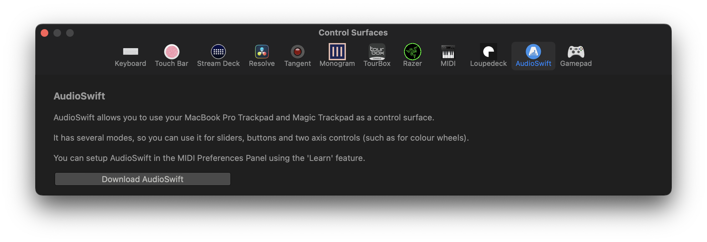

# AudioSwift

AudioSwift allows you to use your MacBook Pro Trackpad and Magic Trackpad as a control surface.

It has several modes, so you can use it for sliders, buttons and two axis controls (such as for colour wheels).

You can setup AudioSwift in the MIDI Preferences Panel using the 'Learn' feature.

You can learn more about AudioSwift [here](https://audioswiftapp.com/fcp/).

