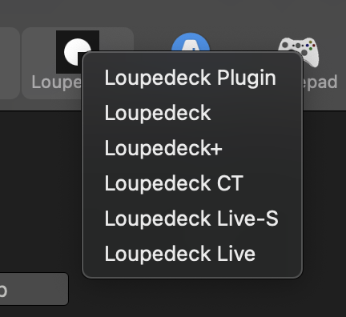
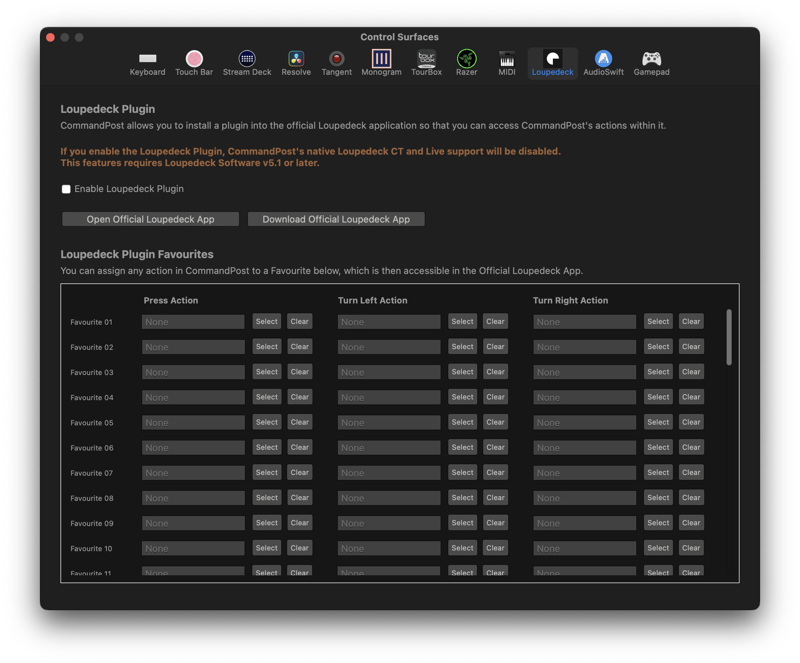
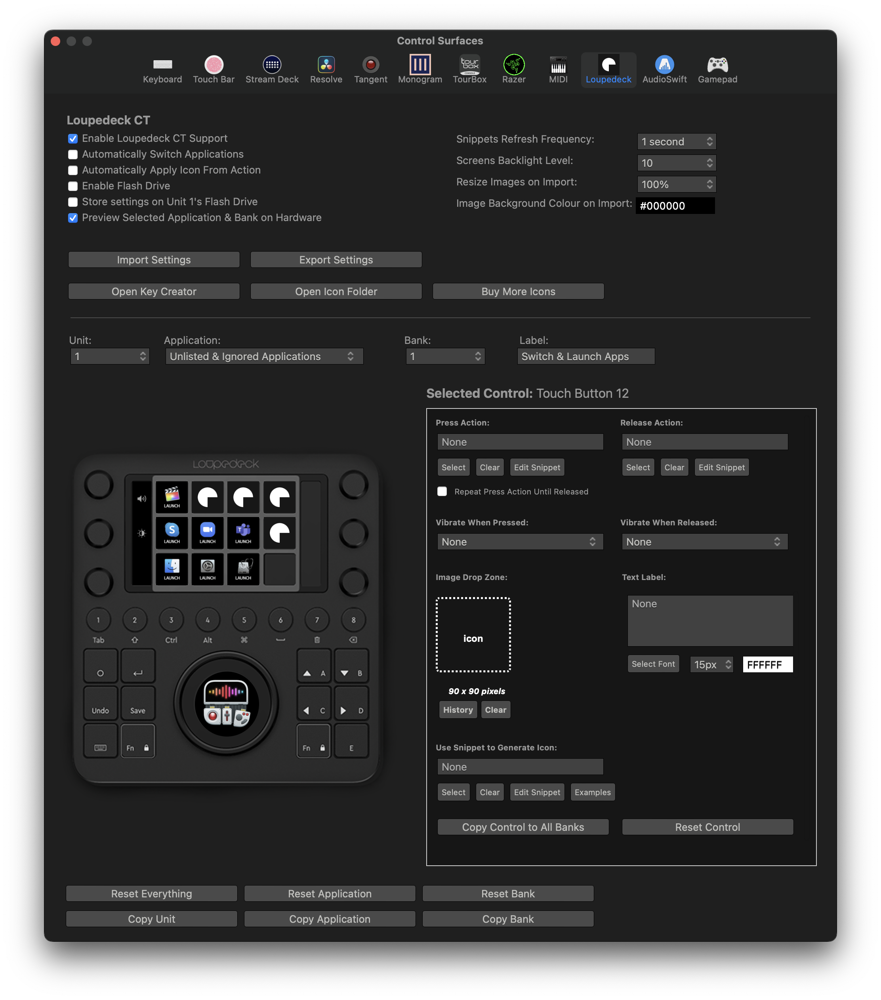

# Loupedeck

There are two ways to interact with Loupedeck devices in CommandPost - native/direct support, and via a Loupedeck Plugin.

You can select between the various Loupedeck devices when you click the Control Surfaces menubar item:

---

### Loupedeck Plugin

CommandPost allows you to install a plugin into the official Loupedeck application so that you can access CommandPost's actions within it.

If you enable the Loupedeck Plugin, CommandPost's native Loupedeck CT and Live support will be disabled.

This features requires Loupedeck Software v5.1 or later.

You can learn more on the [official Loupedeck site](https://support.loupedeck.com/setting-up-commandpost-plugin){target="_blank"}.

---

### Native/Direct Support

You can also avoid the official Loupedeck Plugin all together and let CommandPost talk to the hardware directly.

Using this method gives you a lot more control and flexibility.

---

### Videos

Here's a collection of third-party videos:

- [Arthur Moore demoes CommandPost & Loupedeck+](https://www.youtube.com/watch?v=uNMdDGtIoR0){target="_blank"}
- [YCImaging: THIS Made Me Edit Twice As Fast (Loupedeck CT 2 Years Later)](https://youtu.be/mu67HtWjom8){target="_blank"}
- [Serge M: POWER UP Final Cut Pro with Loupedeck CT & CommandPost](https://www.youtube.com/watch?v=I962Dj5IFzw){target="_blank"}