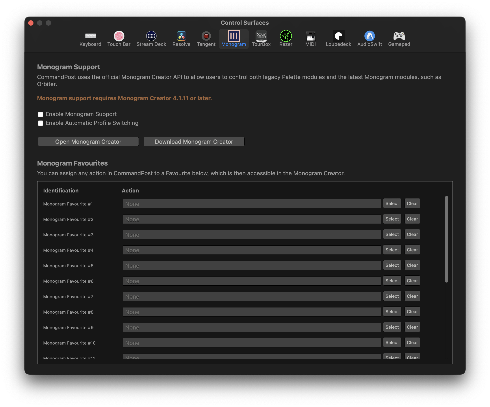

# Monogram

CommandPost uses the official Monogram Creator API to allow users to control both legacy Palette modules and the latest Monogram modules, such as Orbiter.

Monogram support requires Monogram Creator 4.1.11 or later.

You can learn more on the [official Monogram website](https://support.monogramcc.com/hc/en-us/articles/360061670632-Using-Creative-Console-with-Final-Cut-Pro-via-CommandPost-Video-).

---

### Videos

Here's a collection of third-party videos:

- [Ripple Training: Color Grading in Final Cut with Monogram Creating Console](https://www.youtube.com/watch?v=MmG8bhJjdB0){target="_blank"}
- [Matthew O'Brien: Edit & Color Grade FASTER with Monogram's Video Console in Final Cut Pro](https://www.youtube.com/watch?v=p7iyAvGk0lk){target="_blank"}
- [Brad & Donna: Edit 5x Faster with Macros Using Monogram CC](https://www.youtube.com/watch?v=zpO1GjQ8-5w){target="_blank"}
- [Brad and Donna: Supercharge your FCPX Workflow - Monogram Creative Console Review](https://www.youtube.com/watch?v=lj6tZaf7lCY){target="_blank"}
- [LVUP with Monogram - Final Cut Pro setup via CommandPost](https://www.youtube.com/watch?v=DYndh74Fa7U){target="_blank"}
- [Live Demo: Monogram Creative Console + Final Cut Pro](https://www.youtube.com/watch?v=sR7_TZQaZ9w){target="_blank"}
