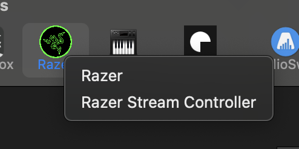
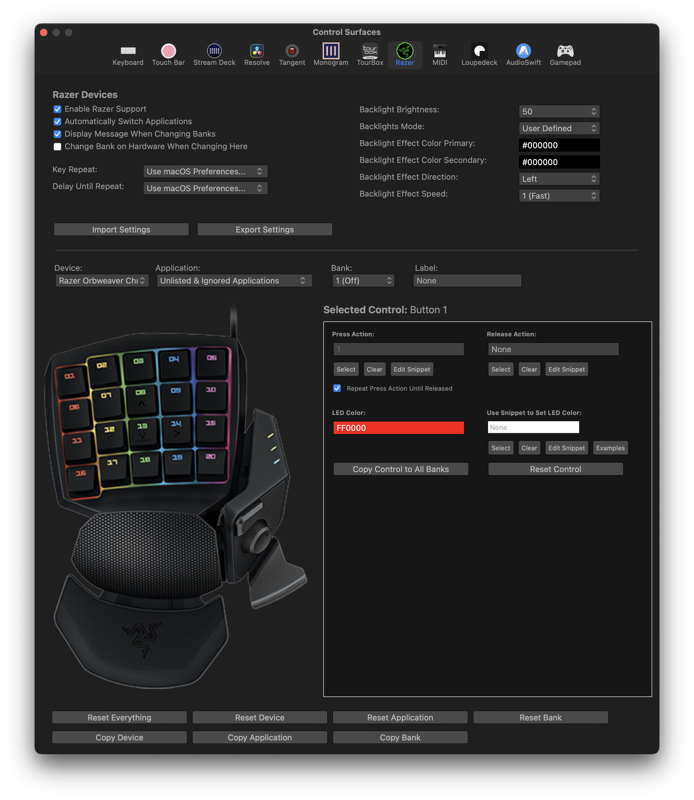
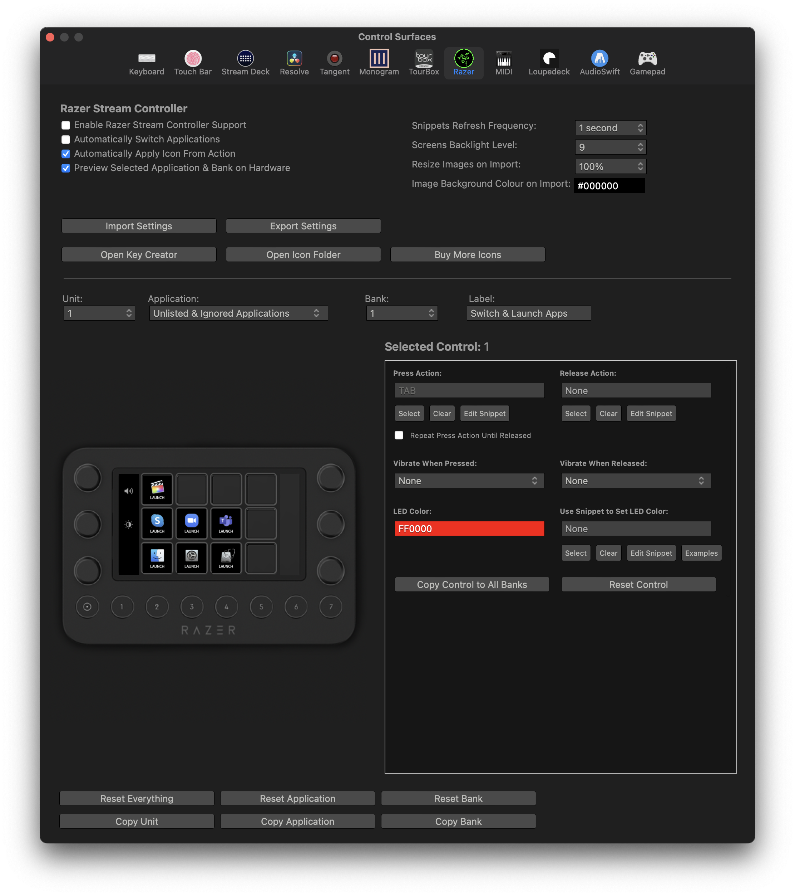

# Razer

CommandPost has support for a huge variety of Razer devices:

- [Razer Stream Controller](https://www.razer.com/au-en/streaming-accessories/razer-stream-controller)
- [Razer Nostromo](https://www2.razer.com/ap-en/gaming-keyboards-keypads/razer-nostromo)
- [Razer Orbweaver](https://www2.razer.com/ap-en/gaming-keyboards-keypads/razer-orbweaver-2012)
- [Razer Orbweaver Chroma](https://mysupport.razer.com/app/answers/detail/a_id/3619/~/razer-orbweaver-chroma-%7C-rz07-01440-support)
- [Razer Tartarus](https://mysupport.razer.com/app/answers/detail/a_id/3614/~/razer-tartarus-%7C-rz07-010301-support)
- [Razer Tartarus Chroma](https://mysupport.razer.com/app/answers/detail/a_id/3617/~/razer-tartarus-chroma-%7C-rz07-01510-support)
- [Razer Tartarus Pro](https://www.razer.com/au-en/gaming-keypads/razer-tartarus-pro)
- [Razer Tartarus V2](https://www.razer.com/gaming-keypads/Razer-Tartarus-V2/RZ07-02270100-R3U1)

You can select between a **Razer** device and a **Razer Stream Controller** when you click the Control Surfaces panel icon:

---

### Razer

You have lots of control over Razer devices:

---

### Razer Stream Controller

The Razer Stream Controller is essentially just a rebranded Loupedeck Live.

