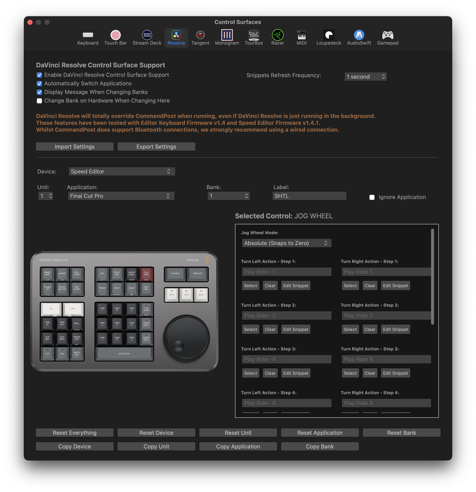

# Resolve

CommandPost allows full control over the [DaVinci Resolve Speed Editor](https://www.blackmagicdesign.com/media/release/20201109-02){target="_blank"} and [DaVinci Resolve Editor Keyboard](https://www.blackmagicdesign.com/au/products/davinciresolve/keyboard){target="_blank"}.

DaVinci Resolve will totally override CommandPost when running, even if DaVinci Resolve is just running in the background.

These features have been tested with Editor Keyboard Firmware v1.4 and Speed Editor Firmware v1.4.1.

Whilst CommandPost does support Bluetooth connections, we strongly recommend using a wired connection.

