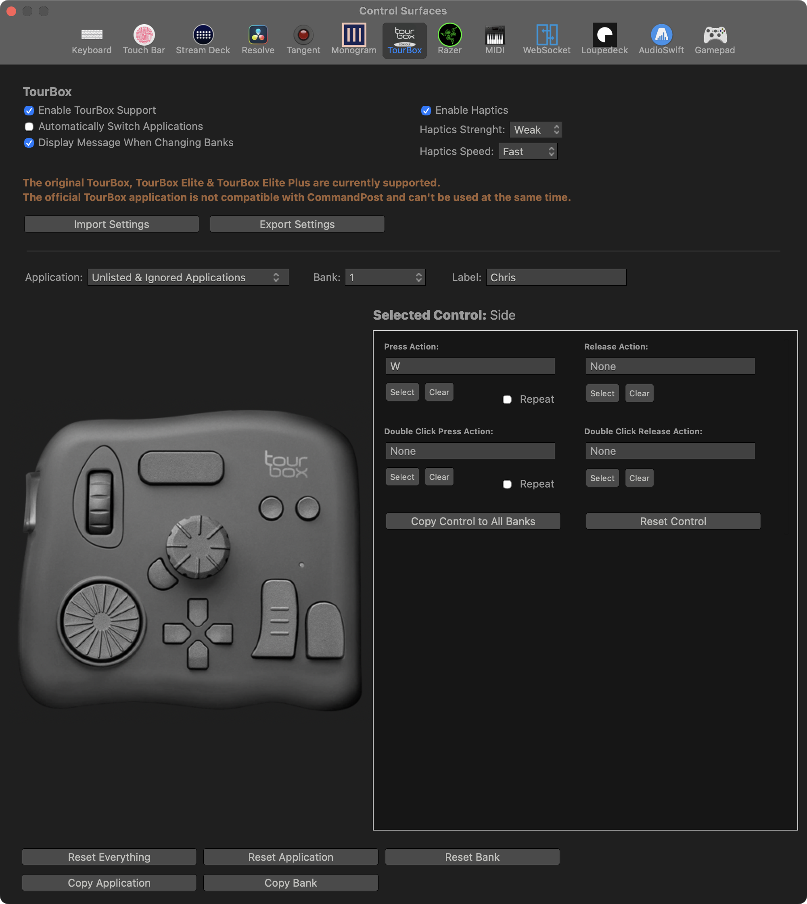

# TourBox

CommandPost has support for the original **TourBox**, **TourBox Elite** and **TourBox Elite Plus**.

Currently we don't support the **TourBox NEO** and **TourBox Lite**.

We have feature requests in GitHub for the [TourBox NEO](https://github.com/CommandPost/CommandPost/issues/3475) and [TourBox Lite](https://github.com/CommandPost/CommandPost/issues/3476).

If you would like to see us add support, please consider [sponsoring CommandPost](/sponsor/) so we can purchase the hardware to develop and test.

If you have the original **TourBox** you need to have firmware installed that was included with **TourBox Console Version v2.1**.

The **TourBox Elite** and **TourBox Elite Plus** have been tested with the firmware that was included with **TourBox Console v5.11.0**.

The **TourBox Elite** and **TourBox Elite Plus** support haptic feedback - the original **TourBox** doesn't have the hardware to do haptic feedback.

Some of the modifier actions in the TourBox control surfaces panel currently only work with the original TourBox.

If you want to use the TourBox with CommandPost, you should make sure that **TourBox Console** is closed - as CommandPost talks directly to the TourBox hardware, without the need for the official software.