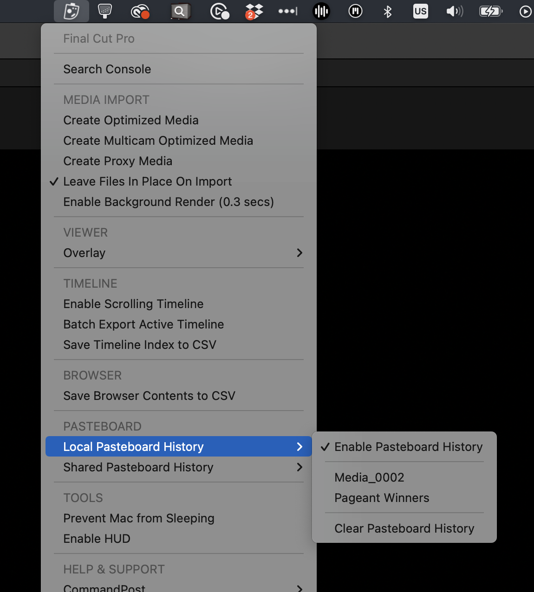

# Local Pasteboard History

This feature is accessible from the CommandPost Menubar when Final Cut Pro is active:

When enabled, anything you copy in Final Cut Pro will be saved to the Pasteboard History, and recalled later.

You can clear the history from the menubar.