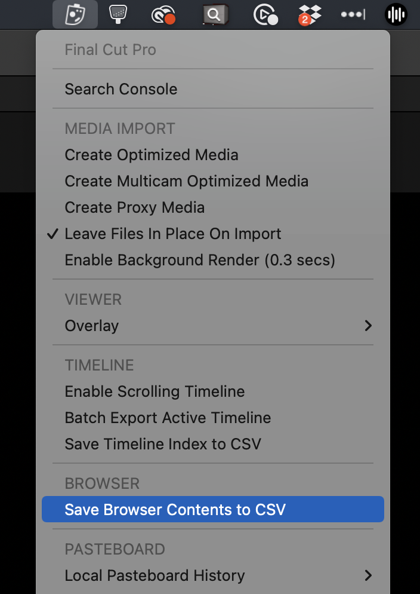
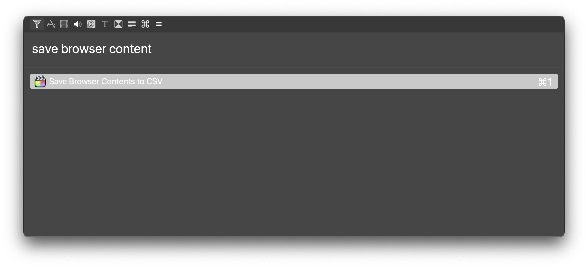
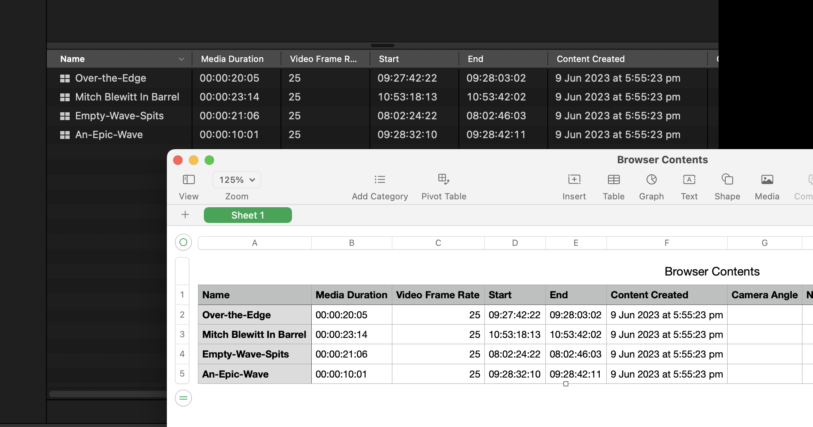

# Save Browser Contents to CSV

This feature allows you to save the entire text contents of your Final Cut Pro **Browser** to a CSV file.

You can access the **Save Browser Contents to CSV** function from the CommandPost Menubar:

You can also access it from the **Search Console**:

When you trigger the action, it will ask you for a **folder** to save the CSV to.

You can then open the CSV in something like Apple's Numbers:

