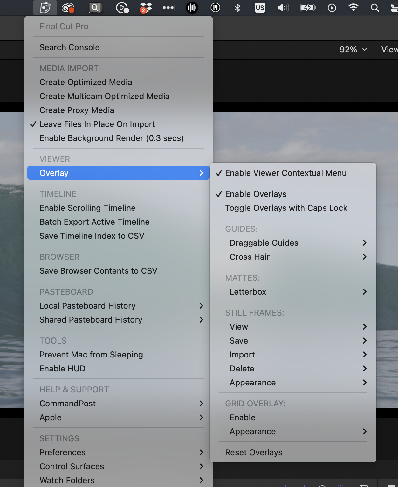
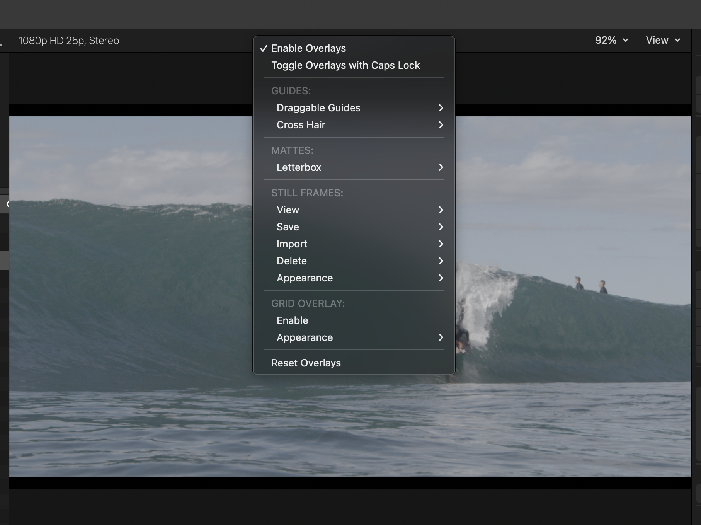
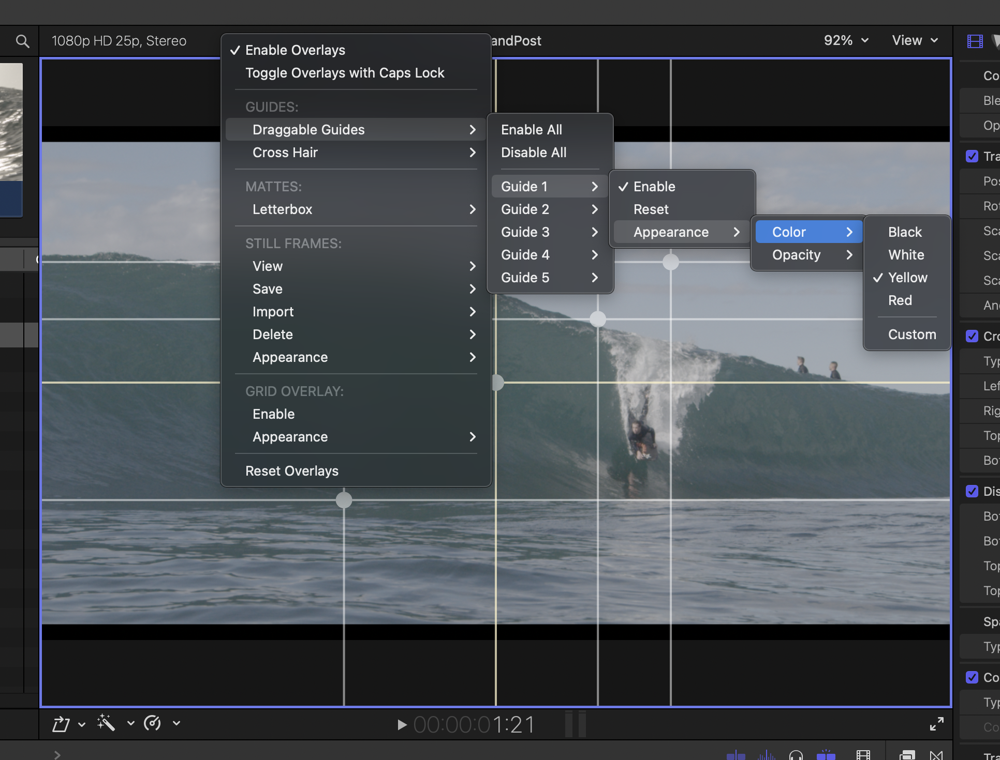

# Viewer Overlay

The Viewer Overlay feature allows you to add overlays on top of Final Cut Pro's Viewer.

You can access the controls from the CommandPost menubar item when Final Cut Pro is active:

If you click **Enable Viewer Contextual Menu** you can also access it by right-clicking on the Final Cut Pro Viewer toolbox:

There's also the option to **Toggle Overlay's with Caps Lock**.

It's extremely customisable and flexible, and a good compliment to Final Cut Pro's own **Custom Overlay** features.

