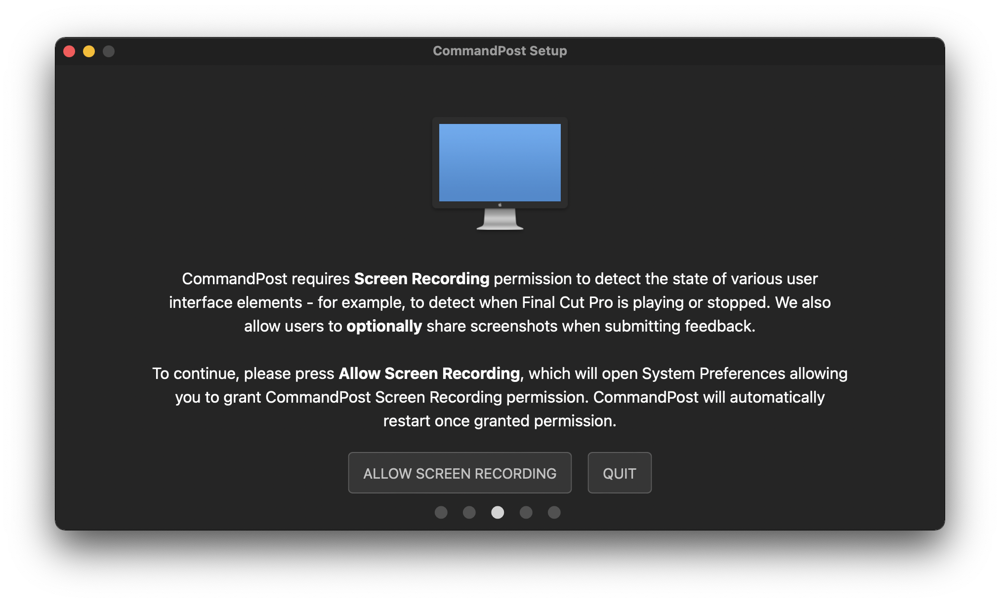
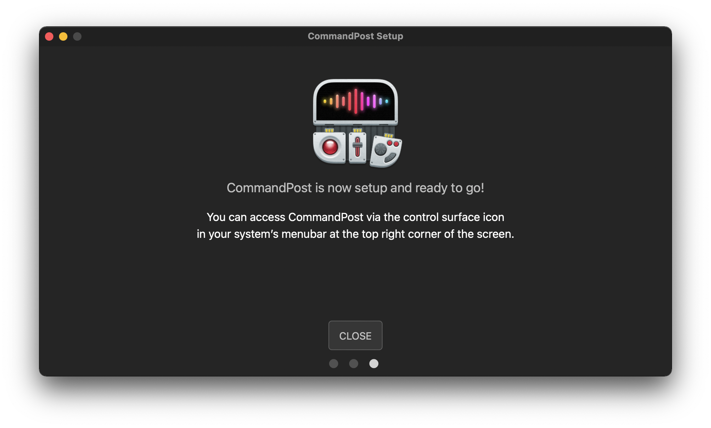

# Installation

You can download the latest release of CommandPost as an DMG package [here](http://commandpost.io).

Once downloaded, simply open the package by double-clicking it.

You might be presented with a warning link below - click **Open** to continue installation.

The DMG package will open, looking like this:

Drag the CommandPost icon to the Folder icon. This will put CommandPost in your Application folder.

Navigate to your Application folder by double clicking the folder icon, and double click the CommandPost icon. You might be presented with another warning like below - click **Open** to continue installation.

CommandPost will now launch the Welcome Screen:

Click **CONTINUE**.

You'll then be presented with the Accessibility Permissions screen:

When you click **ALLOW ACCESSIBILITY**, macOS will present you with this:

Click **Open System Preferences**.

When the **Privacy** Tab of the **Security & Privacy** System Preferences opens, you'll see CommandPost in the "Allow the apps below to control your computer" list. However the panel is locked, so you need to click the paddock icon in the bottom left corner of the screen to make changes.

Use touch ID or enter your computers password to unlock:

Once the preferences are unlocked, you can tick CommandPost in the list. As soon as you click it, System Preferences will close, and you'll go back to the CommandPost setup, presented with the Screen Recording Permissions screen:

When you click **ALLOW SCREEN RECORDING**, the **Privacy** Tab of the **Security & Privacy** System Preferences opens.

You'll see CommandPost in the "Allow the apps below to record the content of your screen, even while using other apps." list. Again, the panel is locked, so you need to click the paddock icon in the bottom left corner of the screen to make changes.

Use touch ID or enter your computers password to unlock:

Once the preferences are unlocked, you can tick CommandPost in the list. As soon as you click it, MacOS will ask you to quit and reopen CommandPost.

Choose **Quit & Reopen**, then after a short delay, CommandPost will close the System Preferences panel and present you with the CommandPost setup:

Since you have already grant the permission CommandPost needs, clicking **CONTINUE** will bring you straight to the Scan Final Cut Pro screen.

When you click **START SCAN** CommandPost will begin scanning your system for Final Cut Pro Plugins & Motion Templates. This process can take several minutes to complete.

Once the scanning is complete you'll be presented with:

Click **CLOSE**, and you're ready to use CommandPost!

You can access CommandPost's features via it's [menubar icon](http://help.commandpost.io/interface/menubar).