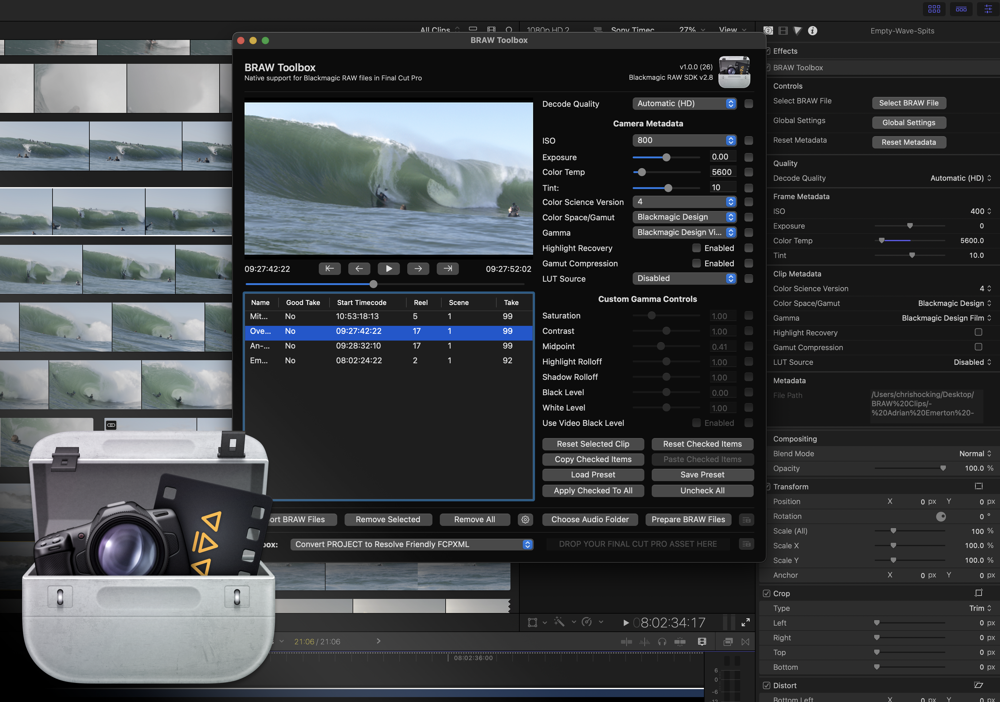
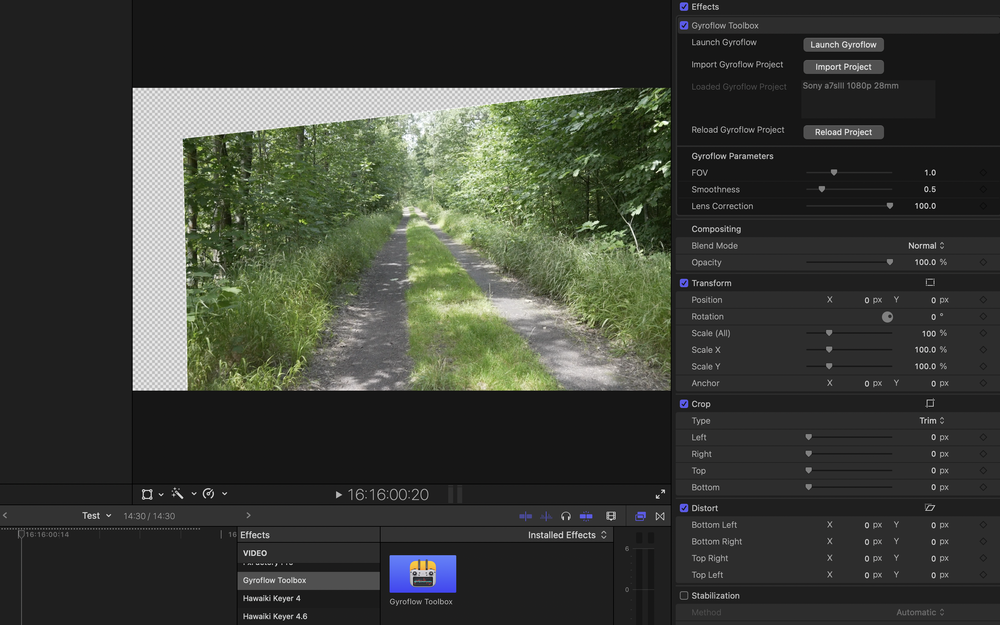
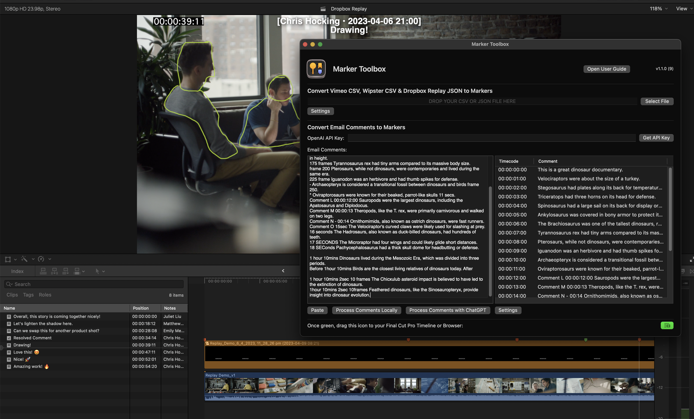
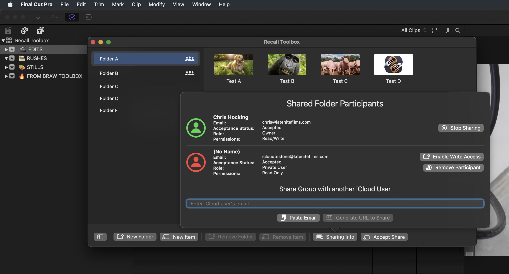
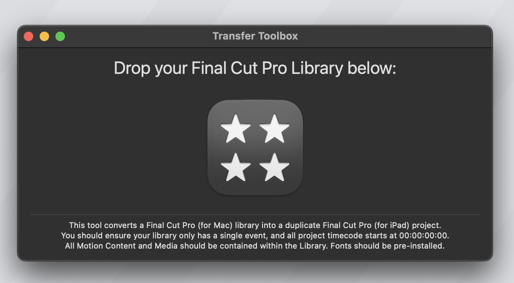

# LateNite Technology

CommandPost was founded by [Chris Hocking](https://twitter.com/chrisatlatenite){target="_blank"} from [LateNite](https://latenitefilms.com/technology){target="_blank"}.

Constantly looking for ways to innovate, **LateNite** is as passionate about production and post production as it is storytelling. Their pursuit of creative excellence has seen them work closely with global cinematic technology companies to craft post workflow solutions and critically celebrated software in-house.

---

### BRAW Toolbox

**BRAW Toolbox** allows you to import Blackmagic RAW files directly into Final Cut Pro without transcoding.

No more waiting. No more transcoding. No more massive ProRes files.

Save hours of time, and terabytes of storage!

The BRAW Toolbox Workflow Extension allows you to prepare all of your footage prior to import. You can easily and quickly change all the RAW parameters, and copy and paste settings from different BRAW clips. You can even save and restore Presets that contain specific parameters, saving time for example, if you always use the same Gamut & Gamma.

Once imported into Final Cut Pro, you can still modify the RAW parameters at any time.

You can even keyframe the ISO, Exposure, Color Temp, Tint and Custom Gamma Controls!

BRAW Toolbox comes with a Metadata View that allows you to view every piece of BRAW Metadata directly within the Final Cut Pro Inspector.

There are automatic Decode Quality options for both HD and UltraHD projects, and you can also work at a low Decode Quality, then apply a "Global Setting" to force Full Quality prior to exporting - meaning you never have to worry about creating proxies for performance. BRAW Toolbox gives you complete freedom and flexibility.

You can also use the Workflow Extension to send your project/timeline to DaVinci Resolve for grading - all using BRAW files directly from the camera!

BRAW Toolbox requires Final Cut Pro 10.6.5 or later.

#### User Reviews

:::review
{{ include "five-stars" }}

This developer did what Apple Couldn't/Wouldn't
This app is a great solution to a common problem Final Cut Pro users have: getting Blackmagic Raw footage into the app. At first it might seem like a bizarre workaround, but you only have to go through the process of setting it up once, and then you can easily import your Blackmagic footage right into FCP. Honestly, from that point on it works so incredibly well that I really struggle to understand why Apple has made it so difficult. Except it's not difficult, not anymore. This is great software: a small developer solving a problem that a big one (Apple) can't. That's innovation, my friends.

_moosefuel – Feb 3, 2023 (Apple App Store Review)_
:::

:::review
{{ include "five-stars" }}

The tool we have dreamed of is here.
For lovers of Final Cut Pro who have struggled with the endless BRAW proxy XML loop, this is a dream come true. BRAW natively inside Final Cut. Controls for RAW adjustments at your fingertips. Is it the full Resolve interface? No, doesnt need to be, Between BRAW ToolBox and FCP, most edits can be done natively without ever having the leave the Final Cut NLE. If you shoot any BRAW camera, this is the best of both worlds if you live in the FCP ecosystem. Thank you latenightfilms team for this, its a huge step forward and a wonderful plugin.

_Chasing Photography – May 16, 2023 (Apple App Store Review)_
:::

:::review
{{ include "five-stars" }}

Perfect!
Just perfect.

_Viaswage – Feb 18, 2023 (Apple App Store Review)_
:::

:::review
{{ include "five-stars" }}

Great!
Love this! thank you!

_NarimanGafurov – Feb 6, 2023 (Apple App Store Review)_
:::

:::review
{{ include "five-stars" }}

UMMMMMM THANK YOU, YOU'RE A GENIUS
I've needed this for years!!!!!! You are a genius and this is incredible!!! Thank you so much!!! No clue how BM never made this.

_gordonfromvan – Feb 4, 2023 (Apple App Store Review)_
:::

:::review
{{ include "five-stars" }}

I've been waiting for this!
I can finally use my two Blackmagic cameras and shoot in BRAW. As a Final Cut Pro editor, I'm really excited. The app is working great! I really appreciate the team at LateNite for all the hard work it took to get this up and running. Well worth the money to be able to handle BRAW seamlessly.
_Scott_Hartman – Feb 2, 2023 (Apple App Store Review)_
:::

:::review
{{ include "five-stars" }}

Boom!
Such an amazing plugin and works fantastic!
_Grant Digital Sky – Feb 2, 2023 (Apple App Store Review)_
:::

:::review
{{ include "five-stars" }}

Absolutely Amazing.
Solves a massive problem and works beautifully!
_Jmurphy8503 – Jan 31, 2023 (Apple App Store Review)_
:::

:::review
{{ include "five-stars" }}

The impossible made possible.
Amazing to work natively with BRAW in my favourite editor. Thank you!
_MadMitch1993 – Jan 30, 2023 (Apple App Store Review)_
:::

[!button text="Visit Website" target="blank" variant="info"](https://brawtoolbox.io)

---

### Gyroflow Toolbox

**Gyroflow Toolbox** allows you to import Gyroflow Projects into Final Cut Pro.

Gyroflow is a free and open source third-party application that can stabilise your video by using motion data from a gyroscope and optionally an accelerometer. Modern cameras record that data internally (GoPro, Sony, Insta360 etc), and Gyroflow stabilizes the captured footage precisely by using them. It can also use gyro data from an external source (eg. from Betaflight blackbox).

Gyroflow Toolbox allows you to take the stabilised data from Gyroflow and use it within Final Cut Pro as an effect, so you don't have to export a ProRes from Gyroflow!

You can even use this in conjunction with BRAW Toolbox (also on the App Store), to stabilise Blackmagic RAW files!

None of this would be possible without the incredible Gyroflow project and the incredibly help and support from their main developer, AdrianEddy.

#### User Reviews

:::review
{{ include "five-stars" }}

Nice product!
Thank you Chris!

_NarimanGafurov – Feb 6, 2023 (Apple App Store Review)_
:::

:::review
{{ include "five-stars" }}

The Best Way to Stabilize Pro Res RAW
I record both internally and externally with an Atomos Ninja, on my FX3 with the end goal of delivering HDR. I record internal to capture Gyroscopic data that my FX3 records. This allows me to Use GryoFlow, and Thus GryoFlow Toolbox to stabilize Pro Res RAW footage. This tool has made it possible, and works awesomely. I highly recommend this tool it will help immensely.

_Tydar94 – Jan 27, 2023 (Apple App Store Review)_
:::

[!button text="Visit Website" target="blank" variant="info"](https://gyroflowtoolbox.io)

---

### Marker Toolbox

**Marker Toolbox** allows you to import Vimeo CSV, Wipster CSV, Dropbox Replay JSON & Email Comments into Apple's Final Cut Pro via a handy Workflow Extension.

You can also OPTIONALLY use OpenAI's ChatGPT to help translate email comments into markers using your own personal OpenAI API key!

If you use Vimeo Review pages or Wipster to share video edits with clients to consolidate feedback, you can simply export a CSV file from Vimeo or Wipster, and drag it into the Workflow Extension to convert the comments into Markers within Final Cut Pro. It's fast and easy!

Dropbox Replay works exactly the same way, except Marker Toolbox will also import any drawn annotations!

Similar to Frame.io's Workflow Extension, the markers come in as a Compound Clip, that you can then "break apart" so that the markers are attached to the clips in your Primary Storyline, meaning that your clients comments stay in the correct position as you make revisions to the edit. For each marker, there's also a title, so that you can easily visually see the comments right in your Viewer - this is great if you need to export an edit with all your client feedback "burnt" into the export.

Replies and the date the comment was added can be included in the Marker names. It also takes "resolved" comments in Vimeo, Wipster & Dropbox Replay, and marks them as "completed" in Final Cut Pro!

You can also easily copy and paste client feedback from emails into the Workflow Extension. In most cases, you can use the "Process Comments Locally" button to use a custom-built algorithm that converts each line of text into a comment. However, you can also the power of OpenAI's ChatGPT to help translate more complicated feedback into markers. You can customise the ChatGPT prompt, and also pick the ChatGPT Model. You supply your own OpenAI API key, giving you full control.

This can be a MASSIVE time saver, as you can simply copy and paste a long list of email comments, and ChatGPT will do the work to convert them into easy-to-read Final Cut Pro markers, that you can then easily navigate via the Timeline Index.

Marker Toolbox requires Final Cut Pro 10.6.5 or later.

#### User Reviews

:::review
I’ve been absolutely flatout while working in Thailand.
[Wipsters](https://www.wipster.io){target="_blank"} has been been great, helping me manage projects and reviewers across four countries. Stoked [Marker Toolbox](https://markertoolbox.io){target="_blank"} can send Wipster notes straight into #fcpx

_Alister Robbie via [Twitter](https://twitter.com/alisterrobbie/status/1664105856475238400)_
:::

:::review
{{ include "five-stars" }}

Excellent addition to FCP
This is a great tool. I have my clients make notes on Vimeo, and Marker Toolbox lets me download a .csv of those comments and create markers on the FCP project/timeline at the proper locations, with notes visible and that will follow the clips as I move them. Once downloaded and installed it's easy. Downloading the .csv and running it through Marker Toolbox and adding the Markers to the project/timeline takes less than a minute, then you're ready to go. Really great find!

_Robert heinlein's son – May 31, 2023 (Apple App Store Review)_
:::

:::review
{{ include "five-stars" }}

Amazing simple
I wanted an app like this since I started editing. Now for the first time I can process the comments I get via an e-mail on an edit from the start and not, as I usualy do, begin at the end of the edit and work backwards.

_Blazy – Apr 6, 2023 (Apple App Store Review)_
:::

[!button text="Visit Website" target="blank" variant="info"](https://markertoolbox.io)

---

### Recall Toolbox

**Recall Toolbox** is a Final Cut Pro Workflow Extension that acts as a Shared Pasteboard.

Anything that you can copy and paste in Final Cut Pro, Recall Toolbox can store.

#### Build for Final Cut Pro

There are third party tools like the amazing Copy 'Em ​(for Mac), but they're not quite as visual as Recall Toolbox, and they're not built from the ground up for Final Cut Pro users.

Recall Toolbox works as a Final Cut Pro Workflow Extension, so it's window position gets saved with your custom Workspaces.

Whilst CommandPost has had a Shared Pasteboard & Pasteboard Buffers for years, it's really optimised for Control Surfaces. You can access the Shared Pasteboard from the CommandPost menubar, and it is super powerful, but it's not as visual - you just get text, not a fully customisable thumbnail.

Recall Toolbox feels like a natural extension to Final Cut Pro, with a similar look and feel to Final Cut Pro's Effects Browser.

#### iCloud Sync

Recall Toolbox automatically syncs to ALL your devices on the same iCloud account automagically!

#### iCloud Sharing

You can share folders with other iCloud users, and control permissions. For example, you could have a "read only" folder that contains client logos for a current job!

[!button text="Visit Website" target="blank" variant="info"](https://recalltoolbox.io)

---

### Transfer Toolbox

**Transfer Toolbox** allows you to convert Final Cut Pro (for Mac) libraries into Final Cut Pro (for iPad) projects!

You can now easily get from your Desktop to your iPad! Simply drag your existing Final Cut Pro library into the application's drop zone.

You should ensure your library only has a single event, and all project timecode starts at 00:00:00:00.

All Motion Content and Media should be contained within the Library.

If you have custom fonts on the Mac Final Cut Pro library, you should manually install them on the iPad before importing the project.

Transfer Toolbox requires Final Cut Pro 10.6.6 or later.

[!button text="Visit Website" target="blank" variant="info"](https://transfertoolbox.io)