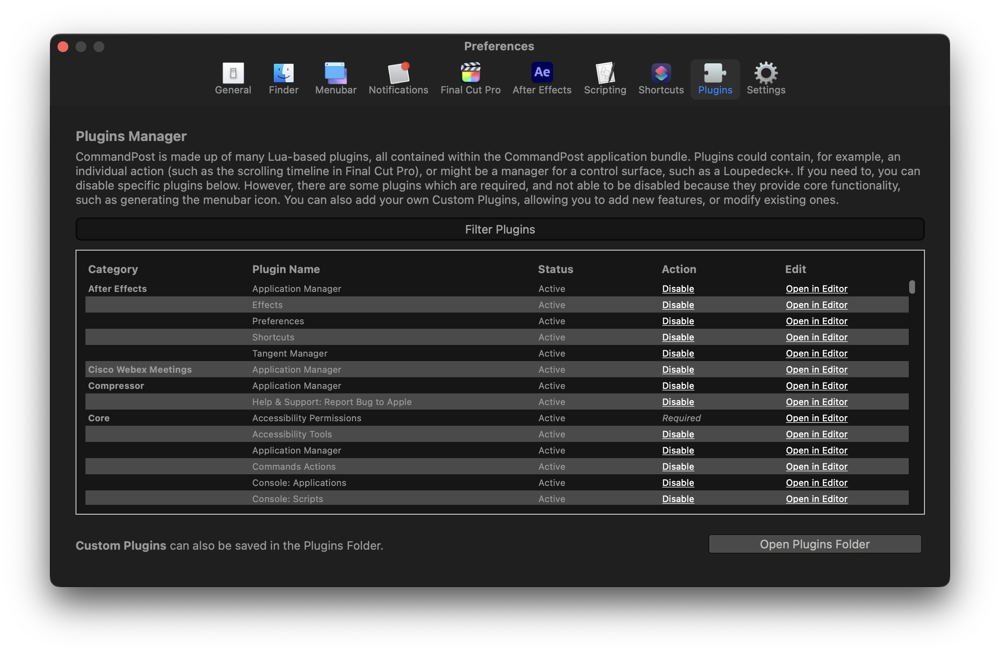

# Plugins

CommandPost is made up of many Lua-based plugins, all contained within the CommandPost application bundle. Plugins could contain, for example, an individual action (such as the scrolling timeline in Final Cut Pro), or might be a manager for a control surface, such as a Loupedeck+. If you need to, you can disable specific plugins below. However, there are some plugins which are required, and not able to be disabled because they provide core functionality, such as generating the menubar icon. You can also add your own Custom Plugins, allowing you to add new features, or modify existing ones.

