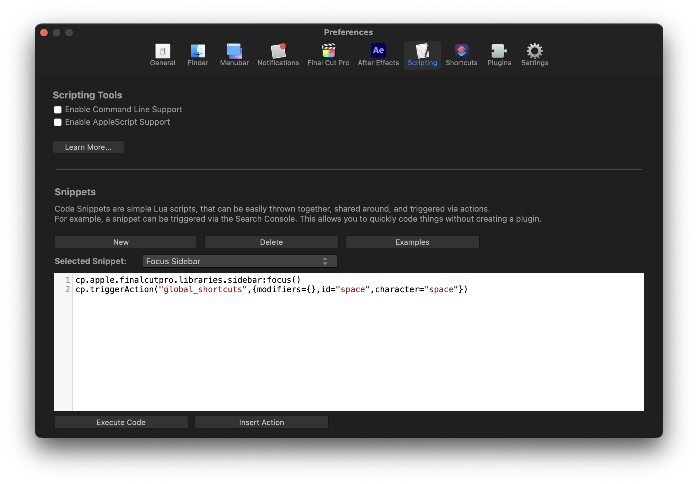

# Scripting

The Scripting preferences panel allows you to enable/disable Command Line Support & AppleScript support.

You can also create Lua Snippets, which appear in the Search Console and can be triggered by any Control Surface or the Search Console.

You can learn more about scripting Snippets [here](/scripting/lua-snippets).

