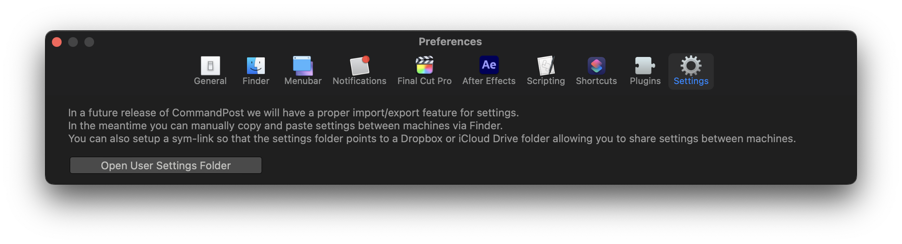

# Settings

In a future release of CommandPost we will have a proper import/export feature for settings.

In the meantime you can manually copy and paste settings between machines via Finder.

You can also setup a sym-link so that the settings folder points to a Dropbox or iCloud Drive folder allowing you to share settings between machines.

