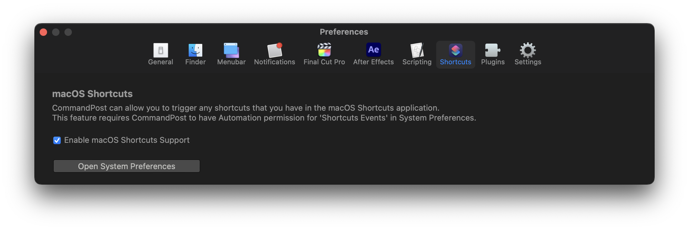

# Shortcuts

CommandPost can allow you to trigger any shortcuts that you have in the macOS Shortcuts application.

This feature requires CommandPost to have Automation permission for 'Shortcuts Events' in System Preferences.

You can enable and disable this feature in the Shortcuts preferences panel:

