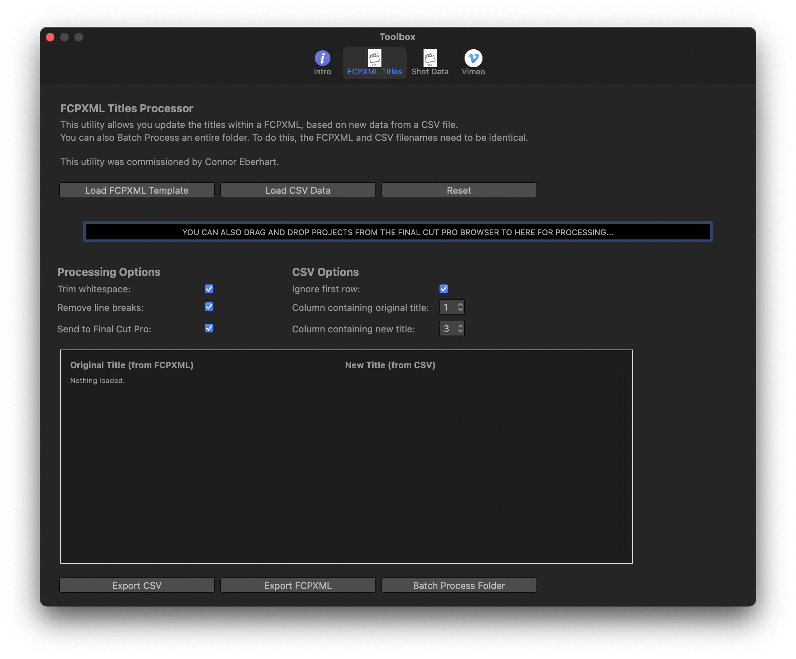

# FCPXML Titles

This utility allows you update the titles within a FCPXML, based on new data from a CSV file.
You can also Batch Process an entire folder. To do this, the FCPXML and CSV filenames need to be identical.

This utility was commissioned by Connor Eberhart.

More detailed documentation will eventually be written here.

