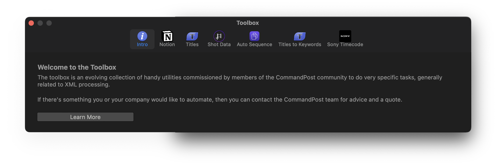

# Intro

The toolbox is an evolving collection of handy utilities commissioned by members of the CommandPost community to do very specific tasks, generally related to XML processing.

If there's something you or your company would like to automate, then you can contact the CommandPost team for advice and a quote.

