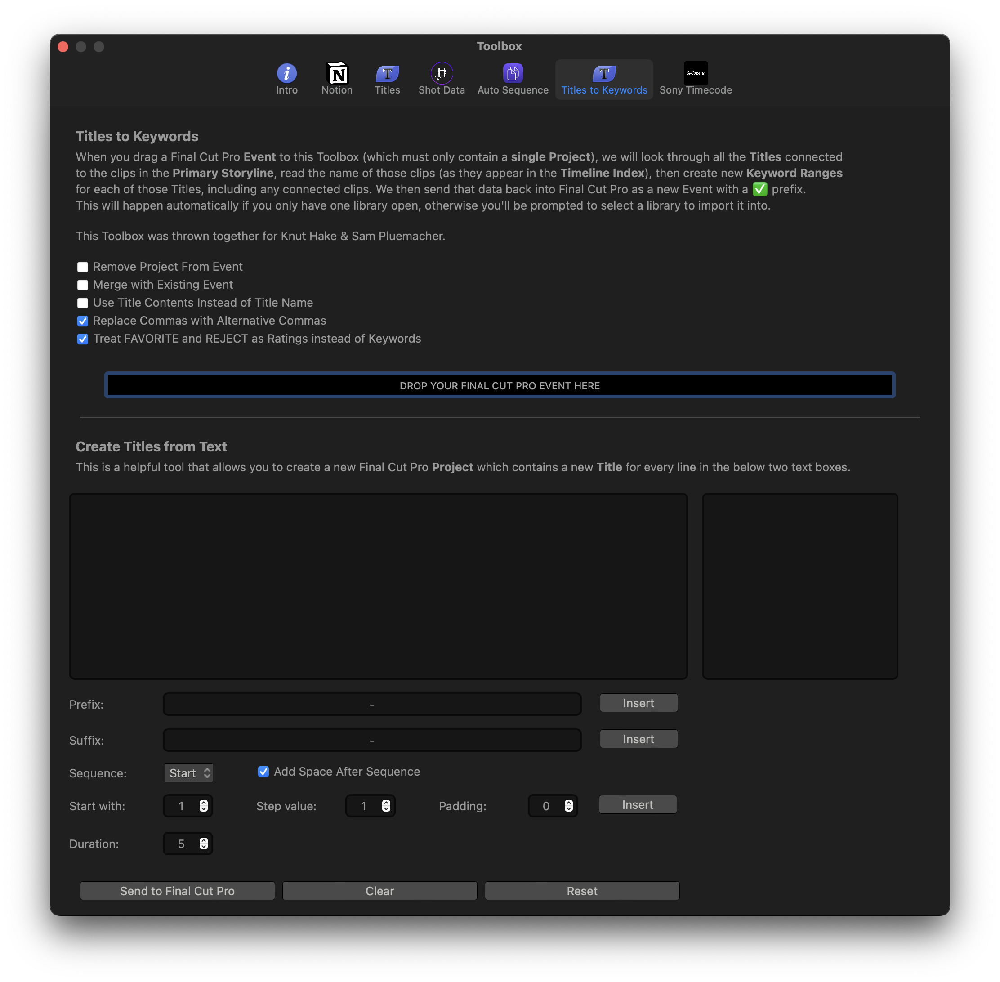

# Titles to Keywords

CommandPost has as insanely powerful Toolbox called **Titles to Keywords**.

You can read about how it's used in professional feature film workflows [here](https://fcp.co/final-cut-pro/2605-a-new-script-focused-feature-film-workflow-for-final-cut-pro).

---

This toolbox is a combination of two handy tools:

- [Titles to Keywords](#titles-to-keywords-1)
- [Create Title from Text](#create-titles-from-text)

---

### Titles to Keywords

When you drag a Final Cut Pro Event to this Toolbox (which must only contain a single Project), we will look through all the Titles connected to the clips in the Primary Storyline, read the name of those clips (as they appear in the Timeline Index), then create new Keyword Ranges for each of those Titles, including any connected clips. We then send that data back into Final Cut Pro as a new Event with a ✅ prefix.

This will happen automatically if you only have one library open, otherwise you'll be prompted to select a library to import it into.

This Toolbox was thrown together for [Knut Hake](http://www.knuthake.de/) & [Sam Pluemacher](https://www.imdb.com/name/nm10223233/).

Options include:

- Remove Project From Event
- Merge with Existing Event
- Use Title Contents Instead of Title Name
- Replace Commas with Alternative Commas
- Treat FAVORITE and REJECT as Ratings instead of Keywords

---

### Create Titles from Text

This is a helpful tool that allows you to create a new Final Cut Pro Project which contains a new Title for every line in the below two text boxes.

Options include:

- Prefix:
- Suffix
- Sequence
  - Start/End
  - Add Space After Sequence
- Start with
- Step value
- Padding
- Duration
