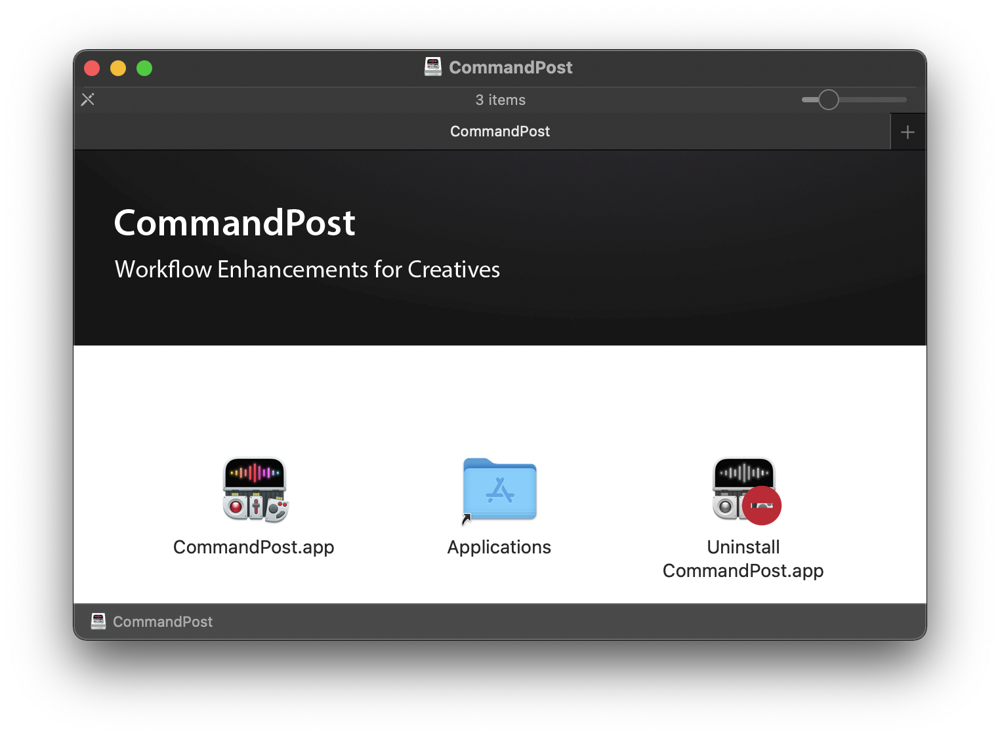

# Uninstall

### Easy Uninstall

Inside the CommandPost DMG package is an uninstall application:



By running this Uninstall application it will remove everything related to CommandPost, including your Preferences and Settings.

If you have enabled "Enable Moving Markers", or changed the "Smart Collection Label" or "Backup Interval", you should change these settings back to their defaults prior to uninstalling CommandPost.

If you have enabled "Waveform Drawing", "Rendering During Playback", "Show Timeline in Viewers", or "Hidden FCPXML Import/Export Options" you can trash the Final Cut Pro preferences by holding down OPTION+COMMAND when you launch Final Cut Pro to reset these values if you've already uninstalled CommandPost.

---

### Manual Uninstall

The CommandPost preferences are located at:

`~/Library/Preferences/org.latenitefilms.CommandPost.plist`

This file can also be dragged to the Trash to remove CommandPost’s Preferences.

Any user created Extensions, Plugins, Shortcuts or Tangent Settings are stored within:

`~/Library/Application Support/CommandPost`

These can be also be removed if required.

CommandPost's WebKit, Crashlytics & Sparkle caches are stored within:

```
~/Library/Application Support/org.latenitefilms.CommandPost
~/Library/Caches/org.latenitefilms.CommandPost
~/Library/WebKit/org.latenitefilms.CommandPost
~/Library/Caches/io.fabric.sdk.mac.data/org.latenitefilms.CommandPost
~/Library/Caches/com.crashlytics.data/org.latenitefilms.CommandPost
~/Library/Caches/com.apple.nsurlsessiond/Downloads/org.latenitefilms.CommandPost
```

These folders can also be removed if required.