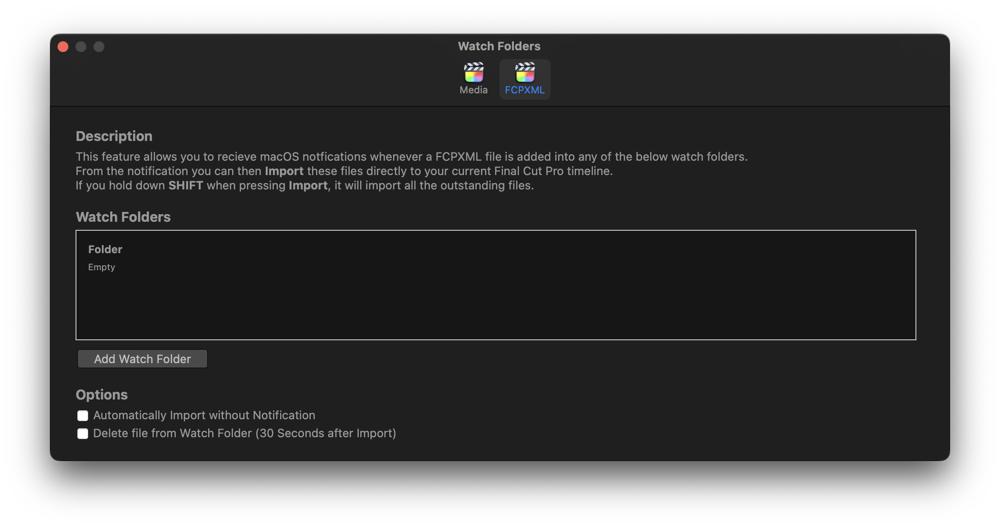

# FCPXML Watch Folder

This feature allows you to recieve macOS notfications whenever a FCPXML file is added into any of the below watch folders.

From the notification you can then Import these files directly to your current Final Cut Pro timeline.

If you hold down **SHIFT** when pressing Import, it will import all the outstanding files.

